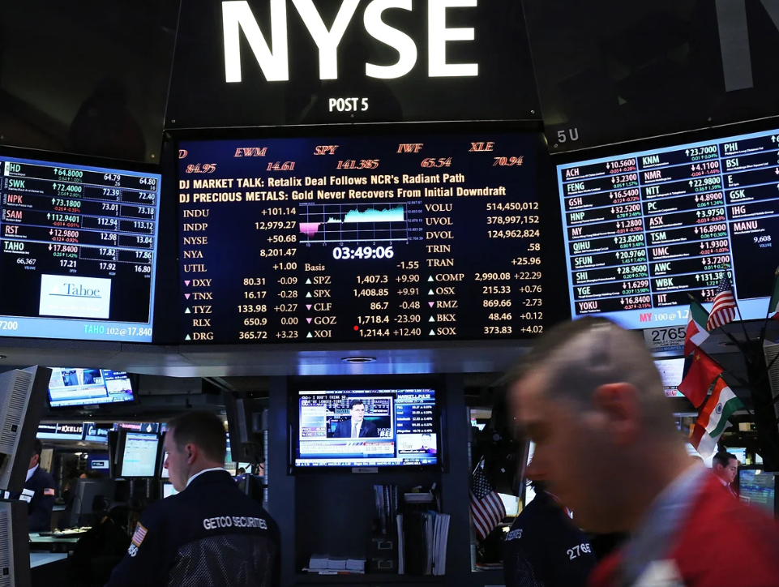

```{r}
#|label: Setup
#|include: false

# this line specifies options for default options for all R Chunks
knitr::opts_chunk$set(echo=F)

# suppress scientific notation
options(scipen=100)

# avoid system issues
options(install.packages.check.source = "no")

# install helper package that loads and installs other packages, if needed
if (!require("pacman")) install.packages("pacman", repos = "http://lib.stat.cmu.edu/R/CRAN/")

# install and load required packages
# pacman should be first package in parentheses and then list others
pacman::p_load(pacman,tidyverse, magrittr, knitr, forecast, kableExtra,
               tidyquant, lubridate, ggthemes, RColorBrewer, dygraphs, renv)

# verify packages
#p_loaded()


```


```{r}
#|label: Functions for Dashboard

# Click green triangle to run these functions

# Function 1 Formats the imported stock data.
fun1 <- function(my_data){
  dbd <- my_data |> 
  fortify.zoo() |> as_tibble(.name_repair = "minimal") 
  names(dbd) <- c("date", "open", "high", "low", "close", "vol", "adj")
  dbd
}

# Function 2 saves the most recent day of data as a separate dataset.
fun2 <- function(my_data){
  last <- my_data |>
    filter(date==max(date))
  last
}

# Function 3 creates an interactive dygraph with event lines and shaded regions.
fun3 <- function(my_data,
                 plot_title,
                 Event1,
                 Label1,
                 Event2,
                 Label2,
                 Shade1,
                 Shade2,
                 LabelS1,
                 LabelS2,
                 Event3,
                 Label3,
                 Event4,
                 Label4){
  
  dg1 <-  dygraph(my_data[,c(2,3,6)], main=plot_title) |>
    dySeries(colnames(my_data[,6]), label="Adj. Close", color= "green") |>
    dySeries(colnames(my_data[,2]), label="High", color= "blue") |>
    dySeries(colnames(my_data[,3]), label="Low", color= "red") |>
    dyAxis("y", label = "", drawGrid = FALSE) |>
    dyAxis("x", label = "", drawGrid = FALSE) |>
    dyShading(from=start_date, to=end_date, color="floralwhite") |>
    dyShading(from=Shade1, to=Shade2, color = "lightgrey") |>
    dyEvent(Event1, Label1, strokePattern = "dotted", labelLoc = "bottom") |>
    dyEvent(Event2, Label2, strokePattern = "dotted", labelLoc = "bottom") |>
    dyEvent(Shade1, LabelS1, labelLoc = "bottom") |>
    dyEvent(Shade2, LabelS2, labelLoc = "bottom") |>
    dyEvent(Event3, Label3, strokePattern = "dotted", labelLoc = "bottom") |>
    dyEvent(Event4, Label4, strokePattern = "dotted", labelLoc = "bottom") |>
    dyRangeSelector()
  dg1
}


# Function 4 makes a dygraph without event lines and shaded regions.
fun4 <- function(my_data, plot_title){
  dg2 <-  dygraph(my_data[,c(2,3,6)], main=plot_title) |>
    dySeries(colnames(my_data[,6]), label="Adj. Close", color= "green") |>
    dySeries(colnames(my_data[,2]), label="High", color= "blue") |>
    dySeries(colnames(my_data[,3]), label="Low", color= "red") |>
    dyRangeSelector()
  dg2
} 

```


```{r results='hide'}
#|label: Specify Dashboard Inputs

# Enter stock and date info as shown

stock_symbol <- "NKE"       # enter stock symbol in quotes
stock_name <- "NIKE INC"  # stock name used plot and for accompanying text
start_date <- "2010-01-01"     # enter start date in quotes as shown
end_date <- "2026-04-21"       # enter end date in quotes as shown
n_forecasts <- 12              # number of monthly forecasts requested

getSymbols(stock_symbol, from = start_date, to = end_date) # don't edit this command

db <- fun1(NKE)             # enter stock symbol without quotes

```


```{r}
#|label: Stock Data Mgmt and Forecasts

# saves last day or stock information
last <- fun2(db) 

# filters stock data to first day of each month
db2 <- db |>
  mutate(year=year(date),
         month=month(date)) |>
  group_by(year,month) |>
  filter(date==min(date)) |>
  ungroup()

db_ts <- ts(db2$adj, freq=12, 
            start=c(min(db2$year), 
                    min(db2$month))) # create time series

# creates forecast model and forecasts for next 12 months
db_fc <- db_ts |> 
  auto.arima(ic="aic", seasonal=F) |>
  forecast(h=n_forecasts)

# calculates accuracy
db_pct_acc <- (100-accuracy(db_fc)[5]) |> round(1)

# create forcast plot
db_fc_plot <- autoplot(db_fc) + 
  labs(y =paste(stock_name, "Stock Price ($ US)") ,
       caption = paste0("100 - MAPE = Model % Accuracy: ", db_pct_acc, "%")) + 
  theme_classic()

```


# Introduction

## Row

### Column {width=70%}

{height="5.5in"}

### Column {width=30%}

This website incorporates forecasting skills from **BUA 345 - Business Analytics** into a dashboard presentation format.

# Stock Time Series and Current Values

## Row {height=15%}

::: {.valuebox}

Last Update:

`r stamp("Saturday, January 1, 1999", quiet = T)(last$date)`

:::

::: {.valuebox}

Opening Value:    

`r last$open |> round(2)`

:::

::: {.valuebox}

Highest Value:

`r last$high |> round(2)`

:::

::: {.valuebox}

Lowest Value:

`r last$low |> round(2)`

:::

::: {.valuebox}

Adj. Closing Value:

`r last$adj |> round(2)`

:::

## Row {height=85% color="Info"}

```{r}
#|label: Create Interactive Dygraph

# replace SYMBOL with stock symbol without quotes
(dg <- fun3(my_data=NKE,
                 plot_title=paste(stock_name, "Stock Price"),
                 Event1="2016-11-8",
                 Label1="2016 Election",
                 Event2="2020-11-3",
                 Label2="2020 Election",
                 Shade1="2020-3-12",
                 Shade2="2021-6-14",
                 LabelS1="Covid Lockdown Began",
                 LabelS2="Covid Restrictions Ended",
                 Event3="2025-1-20",
                 Label3="2025 Inauguration Day",
                 Event4="2026-02-28",
                 Label4="War in Iran Began"))

```

# Index Comparisons '24-'26

```{r results='hide'}
#|label: Create Plots for Comparisons

start_date1 <- ymd("2024-01-02")
end_date1 <- ymd("2026-04-21")

# replace SYMBOL with stock symbol without quotes
CHOSEN <- window(NKE, start=start_date1, end=end_date1)

cp1 <- fun4(my_data=CHOSEN, plot_title = stock_name)

# downloads indices for comparisons
getSymbols("^SPX", from = start_date1, to = end_date1)
getSymbols("NQ=F", from = start_date1, to = end_date1)
getSymbols("DJIA", from = start_date1, to = end_date1)

# creates plots for comparison plot page
cp2 <- fun4(my_data=SPX, plot_title = "S&P 500")
cp3 <- fun4(my_data=`NQ=F`, plot_title = "Nasdaq 100")
cp4 <- fun4(my_data=DJIA, plot_title = "Dow Jones Industrial Average")

```


## Row {height=50%}

```{r}
#|label: Chosen Stock

cp1

```

```{r}
#|label: S&P 500

cp2

```

## Row {height=50%}

```{r}
#|label: Nasdaq 100

cp3

```

```{r}
#|label: Dow Jones Industrial Average

cp4

```


# Forecast Plot

## Row

### Column {width=75%}

```{r}
#|label: Display Forecast Plot

db_fc_plot

```


### Column {width=25%}

- The forecast plot shows the forecasted **`r stock_name`** stock prices for the next `r n_forecasts` months.  

<br>

- The plot also shows the 80% prediction interval in dark purple and the 95% prediction interval in light purple.

<br>

- The numeric values for these forecasted values and prediction intervals are shown in the next tab.


# Forecasted Values Table

## Row

The table below shows the forecast values and 80% and 95% prediction intervals for the `r n_forecasts` requested forecasts for the **`r stock_name`** stock.

## Row

### Column {width=75%}

```{r}
#|label: Display Numerical Forecasts

(db_fc_tbl <- db_fc |> kable() |> kable_styling(full_width = F))

```


### Column {width=25%}

- In March of `r year(end_date1)+1`, the **`r stock_name`** stock price is forecasted to be `r db_fc$mean[11] |> round()` dollars.

<br>

- The width of the 80% prediction interval for this forecast in March of `r year(end_date1)+1` is `r (db_fc$upper[11,1] - db_fc$lower[11,1]) |> round()` dollars.


# Model Residuals

## Row

### Column {width=75%}

```{r}
#|label: Check Residuals

checkresiduals(db_fc, test = F)

```

### Column {width=25%}

- These three residual plots allow the analyst to examine the distribution of the residuals of the modeled time series.

- Despite increasing volatility, our stock price model is estimated to be `r db_pct_acc`% accurate.

- This doesn’t guarantee that forecasts will be `r db_pct_acc`% accurate but it does improve our chances of accurate forecasting.


<br>

- [Additional information about residual plots](https://otexts.com/fpp2/residuals.html){target="_blank"}


# About this Dashboard

This dashboard was created using [Quarto](https://quarto.org/) in [RStudio](https://posit.co/), and the [R Language and Environment](https://cran.r-project.org/).

The datasets used to create this dashboard were downloaded from [Yahoo Finance](https://finance.yahoo.com/).

## Row

***Software Citations***

Arnold J (2024). *ggthemes: Extra Themes, Scales and Geoms for 'ggplot2'*. R package version 5.1.0, <https://CRAN.R-project.org/package=ggthemes>.

Bache S, Wickham H (2025). *magrittr: A Forward-Pipe Operator for R*. doi:10.32614/CRAN.package.magrittr <https://doi.org/10.32614/CRAN.package.magrittr>, R package version 2.0.4, <https://CRAN.R-project.org/package=magrittr>.

Hyndman R, Athanasopoulos G, Bergmeir C, Caceres G, Chhay L, O'Hara-Wild M, Petropoulos F, Razbash S, Wang E, Yasmeen F (2025). *forecast: Forecasting functions for time series and linear models*. R package version 8.24.0, <https://pkg.robjhyndman.com/forecast/>.

Hyndman RJ, Khandakar Y (2008). “Automatic time series forecasting: the forecast package for R.” *Journal of Statistical Software*, *27*(3), 1-22. doi:10.18637/jss.v027.i03 <https://doi.org/10.18637/jss.v027.i03>.

Neuwirth E (2022). *RColorBrewer: ColorBrewer Palettes*. R package version 1.1-3, <https://CRAN.R-project.org/package=RColorBrewer>.

Posit team (2026). RStudio: Integrated Development Environment for R. Posit Software, PBC, Boston, MA. URL http://www.posit.co/.

Quarto Development Team. Quarto. Version 1.9.36. 2026. <https://quarto.org/>.

R Core Team (2026). *R: A Language and Environment for Statistical Computing*. R Foundation for Statistical Computing, Vienna, Austria. <https://www.R-project.org/>.

Rinker, T. W. & Kurkiewicz, D. (2017). pacman: Package Management for R. version 0.5.0. Buffalo, New York. http://github.com/trinker/pacman

Vanderkam D, Allaire J, Owen J, Gromer D, Thieurmel B (2018). *dygraphs: Interface to 'Dygraphs' Interactive Time Series Charting Library*. R package version 1.1.1.6, <https://CRAN.R-project.org/package=dygraphs>.

Wickham H, Averick M, Bryan J, Chang W, McGowan LD, François R, Grolemund G, Hayes A, Henry L, Hester J, Kuhn M, Pedersen TL, Miller E, Bache SM, Müller K, Ooms J, Robinson D, Seidel DP, Spinu V, Takahashi K, Vaughan D, Wilke C, Woo K, Yutani H (2019). “Welcome to the tidyverse.” *Journal of Open Source Software*, *4*(43), 1686. doi:10.21105/joss.01686 <https://doi.org/10.21105/joss.01686>.

Xie Y (2025). *knitr: A General-Purpose Package for Dynamic Report Generation in R*. R package version 1.50, <https://yihui.org/knitr/>.

Yihui Xie (2015) Dynamic Documents with R and knitr. 2nd edition. Chapman and Hall/CRC. ISBN 978-1498716963

Yihui Xie (2014) knitr: A Comprehensive Tool for Reproducible Research in R. In Victoria Stodden, Friedrich Leisch and Roger D. Peng, editors, Implementing Reproducible Computational Research. Chapman and Hall/CRC. ISBN 978-1466561595

Zhu H (2024). *kableExtra: Construct Complex Table with 'kable' and Pipe Syntax*. R package version 1.4.0, https://github.com/haozhu233/kableExtra, <http://haozhu233.github.io/kableExtra/>.
